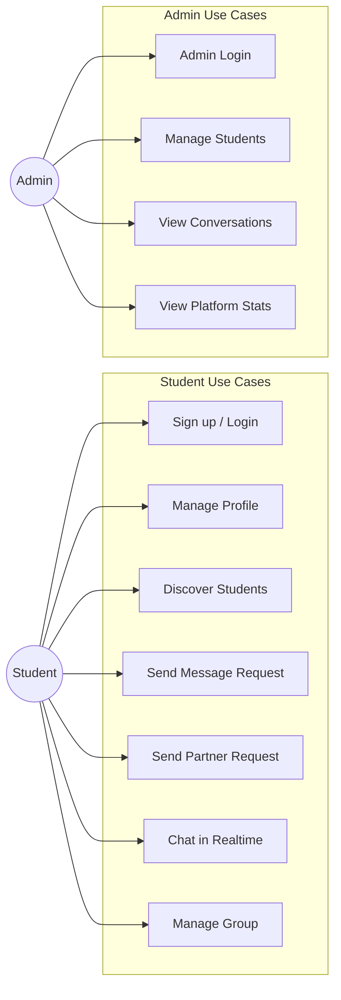
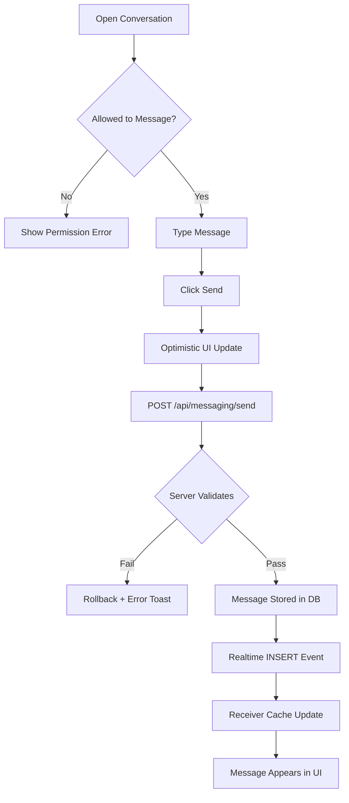
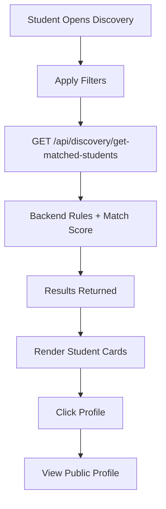
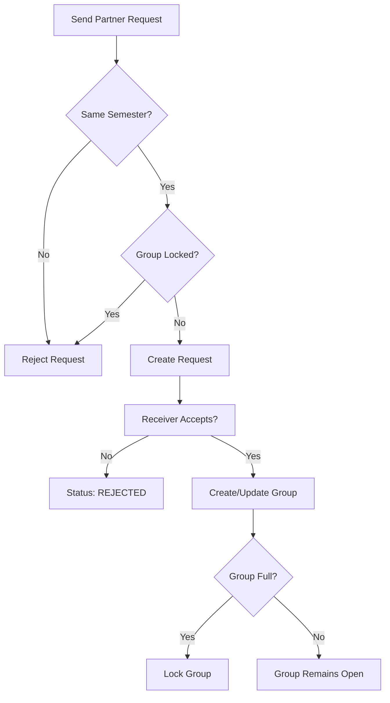
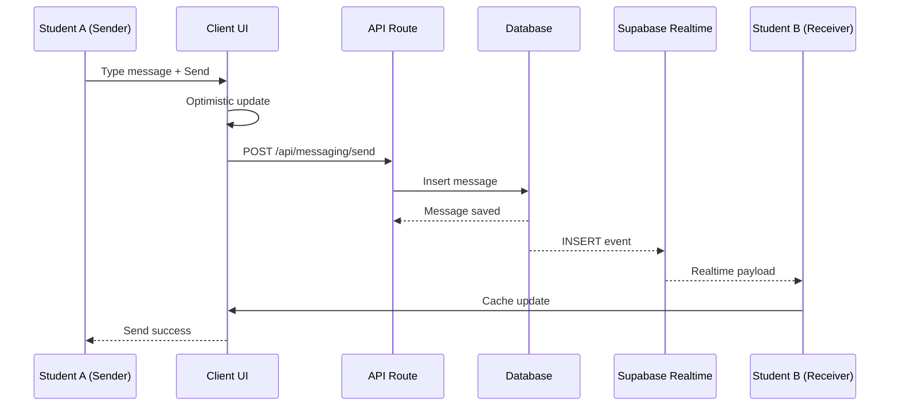
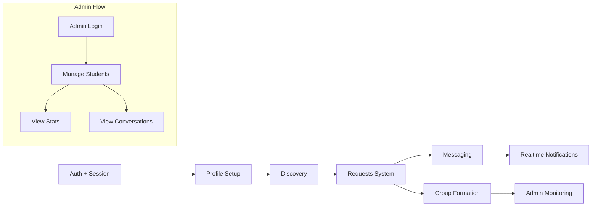

# System Diagrams — FYP Finder

Version: 1.0  
Date: 2026-02-09

---

**Use Case Diagram**

---

**Activity Diagram — Send Message**

---

**Flowchart 1 — Discovery Flow**

---

**Flowchart 2 — Partner Request Flow**

---

**Sequence Diagram — Realtime Messaging**

---

**Whole System Workflow Diagram**

