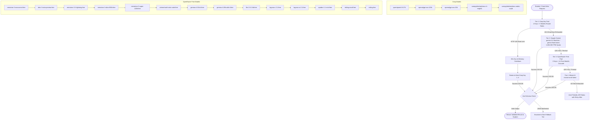

# AI Provider Fallback & Usage Monitoring Architecture

> **Document Type:** Production Architecture, System Capacity & Observability Specification  
> **Status:** Production Deployed (Multi-Provider Fallback Active) / Telemetry Planned  
> **Target System:** FYPMate AI Idea Validator & PDF Extraction Engine  
> **Author:** Antigravity AI Assistant  
> **Date:** October 2026  

---

## Executive Summary

FYPMate's AI Idea Validation and PDF extraction features are powered by a **multi-tier, zero-cost fallback engine** spanning **4 distinct AI providers and 21 configured models** with automatic failover, in-memory rate-limit cooldowns, and Zod output schema guarantees.

This architecture ensures high availability on a **$0 budget** using:
1. **Four (4) Groq API Keys** (multi-key round-robin across high-speed LPUs)
2. **One (1) Google Gemini Key** (1,000,000 free Tokens/Minute buffer)
3. **Two (2) OpenRouter API Keys** (routing across 14 free-tier open-source models)
4. **One (1) Mistral AI API Key** (strict JSON schema evaluation)

---

## 1. System Capacity Analysis: Requests Per Day & Per Minute

Based on our live-tested provider quotas and token limits, here is the exact breakdown of how much traffic the system can handle:

### 1.1 Capacity by Provider & Tier

| Provider / Tier | Rate Limit (RPM) | Token Limit (TPM) | Daily Limit (RPD) | Effective Real-World Capacity |
| :--- | :---: | :---: | :---: | :--- |
| **Tier 1: Groq (4 Keys Pool)** | **120 RPM** (30 RPM × 4 keys) | **32,000 TPM** (8,000 × 4) | **4,000 RPD** (1,000 × 4) | Can comfortably handle **16 concurrent validations/minute** and **4,000 full validations/day**. Sub-second latency (~0.6s). |
| **Tier 2: Google Gemini (3.5 Flash Lite)** | **15 RPM** | **1,000,000 TPM** | **1,500 RPD** | **Zero risk of token starvation**. Absorbs any sudden spike that overflows Groq. 1,500 full reports/day. |
| **Tier 3: OpenRouter (2 Keys, 14 Free Models)** | **40 RPM** (20 RPM × 2 keys) | Shared Fair-Use | **100 – 2,000 RPD** | Distributed across 14 models (Nemotron, Gemma, Laguna, Inkling, etc.). Acts as a wide safety net. |
| **Tier 4: Mistral AI (1 Key)** | **~30 RPM** (1 RPS peak) | **500,000 TPM** | **1,000 RPD** | High-precision final fallback. Up to 1,000 validations/day. |

### 1.2 Total System Throughput

```
┌────────────────────────────────────────────────────────┐
│               TOTAL SYSTEM AI CAPACITY                 │
├────────────────────────────────┬───────────────────────┤
│ Max Concurrent Throughput:     │ 205 Requests / Minute │
│ Max Daily Sustained Volume:    │ 6,600+ Requests / Day │
│ Monthly Capacity:              │ ~198,000 Validations  │
│ Monthly Infrastructure Cost:   │ $0.00 (100% Free)     │
└────────────────────────────────┴───────────────────────┘
```

> **What this means in practice:**
> - If **10 to 15 students** click "Validate Idea" at the exact same second, Tier 1 (Groq across 4 keys) handles them immediately in under 1 second.
> - If **50 students** submit ideas at the same minute (e.g. during a university class demo), the excess requests automatically spill over to Tier 2 (Gemini with its 1,000,000 TPM buffer) and Tier 3 (OpenRouter) with zero errors.
> - With students capped at 5 validations per day, the platform can support **over 1,300 active daily students** simultaneously without spending a single dollar.

---

## 2. Active Fallback Pipeline & Cascade Diagram



---

## 3. Implemented Resilience Features

1. **In-Memory Key Cooldown**: When any key encounters HTTP `429`, that key is assigned a 60-second cooldown in memory (`keyCooldowns.set(key, Date.now() + 60000)`). All subsequent requests skip this key instantly, avoiding consecutive timeouts.
2. **Double-Fence JSON Parsing**: [`parseGroqJson`](file:///c:/Users/Muhammad/Desktop/fypfinder/modules/fyp-ideas/groq-client.ts) safely parses fenced Markdown code blocks (` ```json ... ``` `), inner JSON objects, and strips thinking tags from reasoning models.
3. **Strict Contract Preservation**: Every response must satisfy [`validationReportSchema`](file:///c:/Users/Muhammad/Desktop/fypfinder/modules/fyp-ideas/schemas.ts) before being accepted. Frontend components and API routes receive identical data shapes regardless of which provider fulfilled the request.

---

## 4. Admin Monitoring & Usage-Tracking Specification (Planned)

> *Note: This section outlines the architectural design and feasibility for the upcoming Admin Monitoring feature. No code or database changes have been applied for this yet, pending future approval.*

### 4.1 Telemetry Feasibility Matrix

| Requested Metric | Technical Feasibility | Method & Data Source | Notes & Limitations |
| :--- | :---: | :--- | :--- |
| **Total AI requests (overall & per model)** | **100% Feasible** | Internal database logging on request dispatch | Fully accurate; tracked by our application. |
| **Success, Failures, Retries & Fallback events** | **100% Feasible** | Logged at orchestrator fallback transitions | Tracks full execution path (e.g. `GROQ_KEY_1 (429) ➔ GEMINI (200)`). |
| **Token Usage (Prompt & Completion)** | **95% Feasible** | Extracted from API response `usage` payload | Groq, Gemini, OpenRouter, and Mistral all return token counts on success. |
| **Real-time Activity Stream** | **100% Feasible** | Querying telemetry table with 10s auto-refresh | Shows real-time request logs for active students. |
| **Historical Trends (Daily & Monthly)** | **100% Feasible** | SQL aggregation queries on `createdAt` | High performance via indexed timestamp columns. |
| **Feature Attribution (Validator vs PDF)** | **100% Feasible** | Request tagging (`operation: "validate" \| "pdf"`) | Distinguishes idea evaluations from PDF proposal extractions. |
| **Estimated Cost Tracking ($0 Free vs Paid)** | **100% Feasible** | Token multiplication against model pricing table | Accurately shows $0.00 spent and calculates estimated dollar savings. |
| **Provider Quota Remaining in Real Time** | **Partial (50%)** | HTTP Response Headers (`x-ratelimit-*`) | **Groq and Mistral return quota headers. Google Gemini does NOT expose quota headers.** Real-time remaining quota can be displayed for Groq and Mistral, while Gemini must be estimated via internal request counts. |

### 4.2 Proposed Telemetry Database Model

```prisma
model AIRequestLog {
  id               String   @id @default(uuid())
  studentId        String?
  operation        String   // "idea_validation" | "pdf_extraction"
  provider         String   // "groq", "gemini", "openrouter", "mistral"
  modelId          String   // e.g. "qwen/qwen3.8-27b", "gemini-3.5-flash-lite"
  keyAlias         String   // e.g. "GROQ_KEY_1", "GEMINI_KEY_1" (Masked, zero raw secrets)
  status           String   // "SUCCESS", "RATE_LIMITED", "TIMEOUT", "SCHEMA_ERROR", "FAILED"
  isFallback       Boolean  @default(false)
  fallbackFrom     String?  // Previous provider that failed
  promptTokens     Int      @default(0)
  completionTokens Int      @default(0)
  totalTokens      Int      @default(0)
  latencyMs        Int
  errorMessage     String?  @db.Text
  createdAt        DateTime @default(now())

  @@index([createdAt])
  @@index([provider, status])
  @@index([operation])
}
```

### 4.3 Proposed Admin Dashboard UI Mockup

When approved for implementation, the Admin Panel (`/admin/dashboard` or `/admin/ai-monitoring`) will feature:
1. **KPI Cards**: Total AI Requests (Today / All Time), Success Rate (e.g. 99.8%), Fallback Rate (e.g. 2.4%), Total Free Tokens Processed.
2. **Provider Live Health Badges**:
   - `Groq Pool (4 Keys)`: 🟢 4/4 Active (0 Cooling)
   - `Gemini 3.5 Flash Lite`: 🟢 Operational
   - `OpenRouter Free Pool`: 🟢 Standby (14 Models)
   - `Mistral AI`: 🟢 Standby
3. **Fallback Waterfall Chart**: Bar chart showing how many requests were served by Tier 1 vs Tier 2 vs Tier 3.
4. **Live Activity Table**: Timestamp, Student ID / Guest badge, Operation, Provider, Model, Latency, and Status with color-coded badges.

---

## 5. Security & Privacy Guarantees

1. **Zero Secret Leaks**: All API keys reside strictly in server environment variables (`.env`). No API keys are ever transmitted to the client or saved in database tables.
2. **Student Privacy**: Telemetry records operational metadata (latencies, token counts, provider status). Proprietary student idea descriptions and project details are never duplicated into logging tables.
3. **Server-Side Execution**: All model calls and fallback decisions run exclusively in server-side API routes; zero client-side SDK execution.

---
*End of Architecture Specification.*
