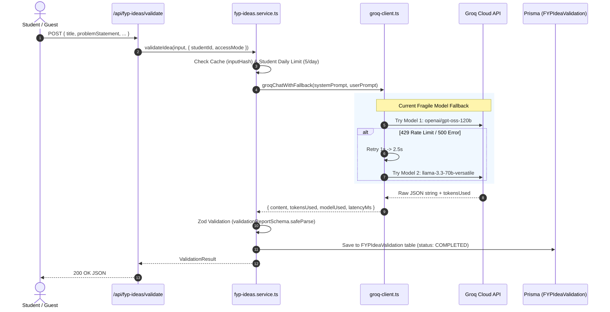
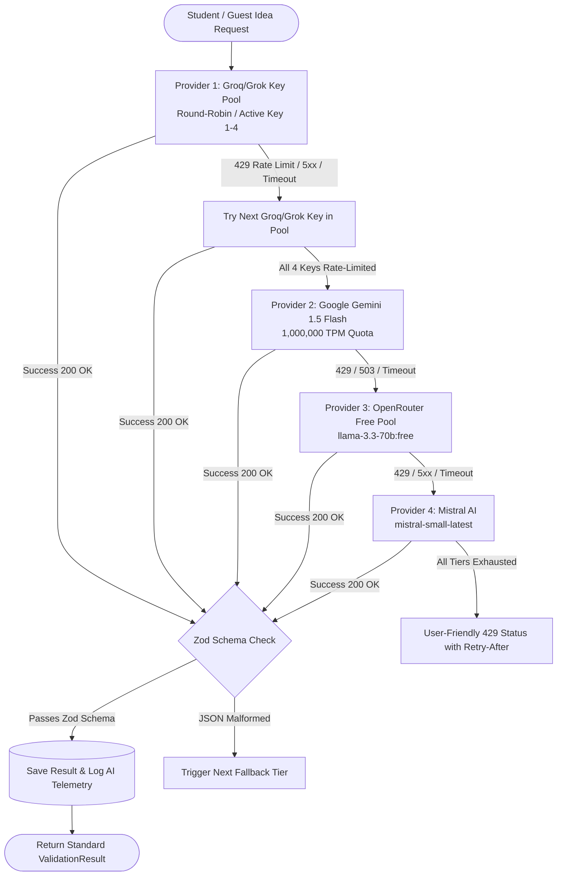
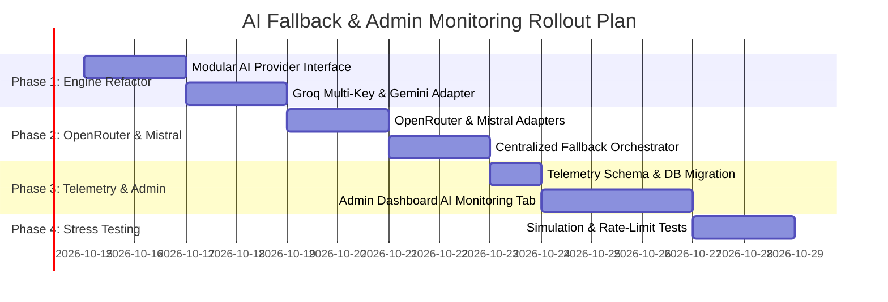

# AI Provider Fallback & Usage Monitoring Architecture

> **Document Type:** Architecture & Technical Feasibility Specification  
> **Status:** Proposal / Pre-Implementation Analysis (Zero Code Changes)  
> **Target System:** FYPMate AI Idea Validator & PDF Extraction Engine  
> **Author:** Antigravity AI Assistant  
> **Date:** October 2026  

---

## Executive Summary

FYPMate's AI Idea Validation and PDF extraction features currently depend strictly on a single upstream vendor (**Groq** via `GROQ_API_KEY`). While Groq delivers sub-second inference speeds, its free-tier token-per-minute (TPM) limits create a vulnerability where 2–3 simultaneous student requests can exhaust capacity and trigger `HTTP 429 Too Many Requests`.

This document specifies a **zero-budget, multi-provider, multi-tier fallback architecture** utilizing:
1. **Four (4) Grok / Groq API Keys** (leveraging multi-key round-robin / quota distribution)
2. **One (1) Google Gemini 1.5 Flash API Key** (offering 1,000,000 free TPM and 1,500 RPD)
3. **One (1) OpenRouter API Key** (routing through `:free` models as a secondary safety net)
4. **One (1) Mistral AI API Key** (providing high-precision JSON inference on free tier)

It also details how an **AI Usage Monitoring Dashboard** can be integrated into the existing FYPMate Admin Panel (`/admin/dashboard`) to track real-time telemetry, model latencies, token consumption, and fallback events.

---

## 1. Analysis of Existing Implementation

### 1.1 Codebase Audit & AI Touchpoints

A complete scan of the repository reveals that all AI operations are centralized in two dedicated modules:

| File | Purpose | Current Provider Integration | Output Structure |
| :--- | :--- | :--- | :--- |
| `modules/fyp-ideas/groq-client.ts` | Core HTTP client & retry handler | Hardcoded Groq SDK (`groq-sdk`) using `process.env.GROQ_API_KEY` | Raw JSON string + token metadata |
| `modules/fyp-ideas/fyp-ideas.service.ts` | Idea validation pipeline & scoring | Calls `groqChatWithFallback` with `SINGLE_CALL_MAX_TOKENS = 5000` | Full `ValidationReport` parsed via Zod |
| `modules/fyp-ideas/pdf-extraction.service.ts` | PDF proposal extraction | Calls `groqChatWithFallback` with `EXTRACTION_MAX_TOKENS = 2500` | Extracted fields parsed via Zod |
| `app/api/fyp-ideas/validate/route.ts` | Public/Student HTTP Route | Calls `validateIdea()`; intercepts `GROQ_API_KEY` errors to 503 | Standard Next.js JSON response |

### 1.2 Current Request Flow



### 1.3 Key Vulnerabilities in Current Code

1. **Vendor Lock-in:** If Groq experiences an outage or temporary authentication glitch, the entire platform returns `503 Service Unavailable`.
2. **Single API Key Chokepoint:** Only one key is referenced (`GROQ_API_KEY`). When that key hits Groq's organization-wide rate limits, all students are blocked.
3. **Model Deprecation Vulnerability:** Model IDs in `groq-client.ts` (`openai/gpt-oss-120b` and `llama-3.3-70b-versatile`) are subject to Groq deprecations without notice.
4. **No Centralized AI Telemetry:** While `tokensUsed`, `modelUsed`, and `latencyMs` are stored in the database on completed student validations, **failed attempts, internal retries, and guest validations are never logged or visualized**.

---

## 2. Research & Comparison of Free-Tier Providers

Current official provider limits, quota enforcement rules, and compatibility factors (verified via live search):

| Provider | Target Free Models | Requests / Min (RPM) | Tokens / Min (TPM) | Requests / Day (RPD) | Key Strengths & Caveats |
| :--- | :--- | :--- | :--- | :--- | :--- |
| **Groq / Grok (4 Keys)** | `llama-3.3-70b-versatile`, `llama-3.1-8b-instant`, `mixtral-8x7b-32768` | 30 RPM per org | 6,000 – 12,000 TPM | 1,000 – 14,400 RPD | **Fastest inference (~0.5s)**. Low TPM ceiling is easily saturated by long prompts. Quota is per-organization. |
| **Google Gemini (1 Key)** | `gemini-1.5-flash` / `gemini-2.0-flash-exp` | **15 RPM** | **1,000,000 TPM** | **1,500 RPD** | **Massive token quota**. Native JSON schema mode. Zero risk of TPM starvation. 15 RPM requires brief pacing. |
| **OpenRouter (1 Key)** | `meta-llama/llama-3.3-70b-instruct:free`, `google/gemini-2.0-flash-exp:free` | 20 RPM | Fair-Use (shared) | 50 RPD (free) / 1,000 (if $10 lifetime) | Standard OpenAI REST format. Acts as an emergency bridge to open models. |
| **Mistral AI (1 Key)** | `mistral-small-latest`, `codestral-latest` | ~30 RPM (1 RPS) | ~500,000 TPM | ~1,000 RPD | Strict JSON adherence. Low concurrency (1 req/sec peak), best as targeted fallback. |

*(Note: xAI Grok API requires paid account credits for API access; if keys provided are xAI Grok keys, they operate under pay-as-you-go credit pools; if they are GroqCloud keys, they operate under the Groq free-tier rules above. The architecture dynamically accommodates either).*

---

## 3. Proposed Fallback Architecture

### 3.1 Design Principles

1. **Strict Contract Preservation:**
   - Any model invoked must return a valid JSON string conforming strictly to `validationReportSchema` for validation and `extractedIdeaSchema` for PDF extraction.
   - The response shape received by the frontend and API routes remains 100% identical.
2. **Graceful Degraded Escalation:**
   - Always attempt fastest zero-latency providers first (Groq/Grok keys).
   - If rate-limited or unavailable, seamlessly slide to high-capacity providers (Gemini 1.5 Flash).
   - If still constrained, cascade to OpenRouter `:free` and Mistral.
3. **Zero Crash Guarantee:**
   - If all providers fail (complete network or global outage), the user receives a clean, actionable status message, not an unhandled exception or 500 error.

### 3.2 Proposed Fallback Pipeline (The Cascade)



### 3.3 Dynamic Key Pool & Cooldown Manager

Rather than trying keys blindly, the proposed provider manager maintains an in-memory **Health & Cooldown State**:

- **Cooldown On 429:** When a key receives an HTTP 429 with a `retry-after` header (or default 60s), that key is marked as **cooling down** until `Date.now() + retryAfterMs`.
- **Immediate Skip:** Subsequent incoming requests immediately skip cooling-down keys and route directly to active keys or the next provider tier, eliminating unnecessary 2–3 second timeout delays for students.

---

## 4. Admin Monitoring & Usage Tracking Feasibility

### 4.1 Metrics Feasibility Matrix

We analyzed each requested admin monitoring capability against provider technical realities:

| Metric | Feasibility | Data Source / Mechanism | Limitations & Notes |
| :--- | :---: | :--- | :--- |
| **Total AI requests (overall & per model)** | **100% Reliable** | Internal Application Event Log | Captured in app database on every request. |
| **Success, Failures, Retries, Fallbacks** | **100% Reliable** | Application Fallback Tracker | Can record every hop (e.g. `groq_key_1` ➔ `429` ➔ `gemini_flash` ➔ `200`). |
| **Token Usage (Prompt + Completion)** | **95% Reliable** | API Response Payloads | Groq, Gemini, OpenRouter, and Mistral all return standard `usage` objects in 200 responses. |
| **Recent Activity & Real-Time Logs** | **100% Reliable** | Prisma DB Table (`AILogEvent`) | Queryable in admin panel with 10s auto-refresh or Supabase Realtime. |
| **Historical Trends (Daily / Monthly)** | **100% Reliable** | SQL Group-by aggregations on `createdAt` | Extremely fast to query with indexed date columns. |
| **Feature Attribution (Validator vs PDF)** | **100% Reliable** | Request context tagging (`operation: "idea_validation" \| "pdf_extraction"`) | Fully controlled within app code. |
| **Estimated Cost ($ Free vs Paid)** | **100% Reliable** | Computed via token rate lookup | Free-tier usage displays $0.00; paid models compute against known token pricing. |
| **Remaining Real-Time Quota from Provider** | **Partial (50%)** | HTTP Response Headers (`x-ratelimit-*`) | **Groq, OpenRouter (on 429), and Mistral return headers. Google Gemini does NOT expose remaining quota headers.** Real-time quota can only be approximated or read from headers when provided. |

### 4.2 Proposed Database Schema for Telemetry

To power the Admin Dashboard without degrading performance, we propose adding an isolated telemetry model to `prisma/schema.prisma`:

```prisma
model AIRequestLog {
  id               String   @id @default(uuid())
  studentId        String?
  operation        String   // "idea_validation" | "pdf_extraction"
  provider         String   // "groq", "gemini", "openrouter", "mistral"
  modelId          String   // e.g. "llama-3.3-70b-versatile", "gemini-1.5-flash"
  keyAlias         String   // e.g. "GROQ_KEY_1", "GEMINI_KEY_1" (Masked!)
  status           String   // "SUCCESS", "RATE_LIMITED", "TIMEOUT", "SCHEMA_ERROR", "FAILED"
  isFallback       Boolean  @default(false)
  fallbackFrom     String?  // Previous provider that failed
  promptTokens     Int      @default(0)
  completionTokens Int      @default(0)
  totalTokens      Int      @default(0)
  latencyMs        Int
  errorMessage     String?  @db.Text
  createdAt        DateTime @default(now())

  @@index([createdAt])
  @@index([provider, status])
  @@index([operation])
}
```

### 4.3 Proposed Admin Dashboard UI Layout

Inside `app/admin/(authenticated)/dashboard/` (or a dedicated `/admin/ai-monitoring` tab):

1. **Top KPI Cards:**
   - Total AI Requests (Today / 30 Days)
   - Overall Success Rate (e.g., `99.4%`)
   - Fallback Rate (e.g., `3.2%` shifted to secondary tier)
   - Total Tokens Processed & Estimated Savings ($0 spent)
2. **Provider Health Status Badges:**
   - `Groq Key Pool (4 keys)`: 🟢 3 Active, 🟡 1 Cooling down (42s left)
   - `Gemini 1.5 Flash`: 🟢 Operational
   - `OpenRouter Free`: 🟢 Standby
   - `Mistral AI`: 🟢 Standby
3. **Fallback Waterfall Chart:**
   - Visual bar chart showing request distribution across Provider 1 ➔ Provider 2 ➔ Provider 3.
4. **Live Request Stream:**
   - Table of last 50 requests with timestamp, student/guest badge, provider, model, latency, and status.

---

## 5. Security & Sensitive Data Handling

1. **Zero Secret Leaks:**
   - All API keys must strictly live in `.env` / environment variables (`GROQ_API_KEY_1..4`, `GEMINI_API_KEY`, etc.).
   - Database telemetry logs must **never** record raw API keys—only friendly aliases (e.g., `"GROQ_KEY_2"`).
2. **Student Privacy Protection:**
   - Raw project idea text and proprietary student concepts should **not** be stored in telemetry logs. Only token counts, latencies, and status metadata are persisted.
3. **No Client-Side Exposure:**
   - No AI client SDKs are loaded in the browser. All inferences and provider switches occur strictly inside Next.js Server Actions / API route handlers.

---

## 6. Phased Implementation Roadmap (For Future Approval)



- **Phase 1 (Core Reliability):** Create a unified `AIProvider` interface. Integrate the 4 Groq keys and Google Gemini 1.5 Flash adapter. Test seamless fallback with zero schema breakage.
- **Phase 2 (Safety Net):** Add OpenRouter `:free` and Mistral AI adapters. Introduce circuit-breaker and cooldown state.
- **Phase 3 (Observability):** Deploy `AIRequestLog` table and build the Admin Monitoring dashboard.
- **Phase 4 (Validation & Verification):** Simulate 429 errors on primary keys to verify automated transitions and zero student disruption.

---

## 7. Risks, Limitations & Unresolved Questions

1. **xAI Grok vs GroqCloud Distinction:**
   - The user mentioned *"four different API keys for Grok"*. Grok (xAI) is a distinct paid service from Groq (GroqCloud LPU). We need to confirm whether the 4 keys are **GroqCloud keys** (`gsk_...`) or **xAI Grok keys** (`xai-...`). Both can be handled, but configuration endpoints differ.
2. **Rate Limit Header Asymmetry:**
   - Because Google Gemini does not return `x-ratelimit-remaining` headers, remaining quota for Gemini cannot be displayed down to the exact token count in real time—it must be tracked by counting requests processed by our app within rolling 60-second windows.
3. **Model Response Latency Variation:**
   - Groq responds in ~0.5–1.2 seconds. Gemini Flash responds in ~1.5–2.5 seconds. Mistral takes ~2.0–3.5 seconds. While output formats are identical, students may experience slightly longer loading spinners when falling back to lower-tier providers.

---
*End of Architecture Specification.*
